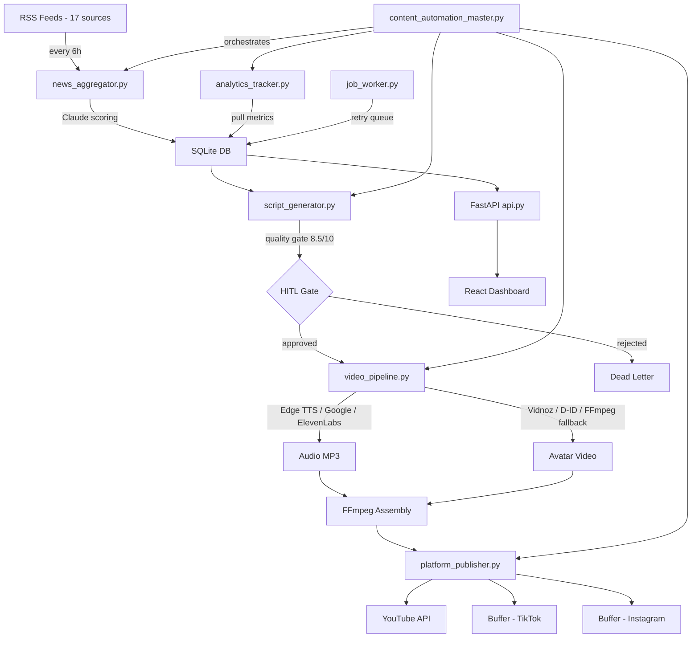

# Bolt AI v2 - Architectural Review and Improvement Plan

## Project Overview

Bolt AI v2 is an automated AI-powered content pipeline that generates short-form video content (YouTube Shorts, TikTok, Instagram Reels) from AI news. The system fetches news via RSS, generates scripts with Claude, synthesizes voice, creates avatar videos, and publishes across platforms -- all orchestrated by a Python backend with a React/TypeScript dashboard.

---

## Architecture Diagram



---

## What Is Done Well

### 1. Tiered Provider Fallback Strategy
The voice and avatar pipelines use a smart cascading fallback approach: Edge TTS free, then Google TTS free tier, then ElevenLabs. Same for avatars: Vidnoz, then D-ID, then FFmpeg text-card. This is a solid cost optimization pattern.

### 2. Quality Gate with Auto-Retry
The Claude-powered scoring system with a configurable 8.5/10 threshold and up to 3 retry attempts is a strong approach for maintaining content quality without human intervention.

### 3. Budget Enforcer as Safety Net
The [`BudgetEnforcer`](bolt_ai_v2/bolt_v2/code/budget_enforcer.py) with hard stops before expensive API calls is critical for preventing runaway costs. The separation between soft alerts and hard stops is well-designed.

### 4. Human-in-the-Loop Design
The [`hitl.py`](bolt_ai_v2/bolt_v2/code/hitl.py) module with multiple approval paths (CLI, flag file, dashboard) is practical and well-thought-out. The timeout-based auto-rejection prevents indefinite pipeline stalls.

### 5. Structured Logging and Observability
The [`observability.py`](bolt_ai_v2/bolt_v2/code/observability.py) module with JSON-formatted logs and token-bucket rate limiting is production-appropriate.

### 6. Database Schema
The SQLite schema in [`database.py`](bolt_ai_v2/bolt_v2/code/database.py) is well-normalized with proper foreign keys, WAL mode, and a clean table structure covering the full pipeline lifecycle.

### 7. Docker Setup
The [`docker-compose.yml`](bolt_ai_v2/bolt_v2/docker-compose.yml) cleanly separates API, pipeline scheduler, and job worker into distinct services with proper health checks and volume mounts.

---

## Critical Issues Found

### 1. Syntax Error in content_automation_master.py

**File:** [`content_automation_master.py`](bolt_ai_v2/bolt_v2/code/content_automation_master.py:56)

```python
try:
    import news_aggregator, script_generator, video_pipeline
    import platform_publisher, analytics_tracker
    from notifications import NotificationManager, Notification, NotificationLevel
    from cost_tracker import CostTracker
    from backup_system import BackupSystem
    from database import get_db
    from hitl import wait_for_approval
from budget_enforcer import BudgetEnforcer, BudgetExceededError  # <-- wrong indentation
```

The `from budget_enforcer` line at line 56 is at the wrong indentation level -- it is outside the `try` block. This will cause an `IndentationError` on startup.

### 2. Config Loading Duplication

Every module has its own `load_config()` function that reads `config.json` from disk independently:
- [`news_aggregator.py`](bolt_ai_v2/bolt_v2/code/news_aggregator.py:23)
- [`script_generator.py`](bolt_ai_v2/bolt_v2/code/script_generator.py:19)
- [`video_pipeline.py`](bolt_ai_v2/bolt_v2/code/video_pipeline.py:15)
- [`platform_publisher.py`](bolt_ai_v2/bolt_v2/code/platform_publisher.py:18)
- [`analytics_tracker.py`](bolt_ai_v2/bolt_v2/code/analytics_tracker.py:17)

Most of these do NOT run secrets through `load_all_secrets()`, meaning they read raw placeholder values like `"set ANTHROPIC_API_KEY in .env"` instead of actual secrets. Only [`content_automation_master.py`](bolt_ai_v2/bolt_v2/code/content_automation_master.py:33) and [`api.py`](bolt_ai_v2/bolt_v2/code/api.py:51) properly inject secrets.

### 3. No Tests Whatsoever

Zero test files exist in the entire repository. For a pipeline that handles real API keys, publishes to live platforms, and spends real money, this is a significant risk.

### 4. Dashboard Fetches Static JSON Instead of API

The [`Dashboard.tsx`](bolt_ai_v2/bolt_v2/bolt-dashboard/src/pages/Dashboard.tsx:45) page fetches from `/data/analytics.json` and `/data/system-status.json` static files instead of using the [`api.ts`](bolt_ai_v2/bolt_v2/bolt-dashboard/src/lib/api.ts) client that is already built. The api client exists and is well-structured but the dashboard pages do not use it.

### 5. CORS Wildcard in Production

```python
allow_origins=["http://localhost:5173", "http://localhost:3000", "http://localhost:4173", "*"]
```

The `"*"` wildcard in [`api.py`](bolt_ai_v2/bolt_v2/code/api.py:78) combined with `allow_credentials=True` is a security vulnerability. Browsers will reject this combination, and it should be locked down per environment.

### 6. Hardcoded Backup Path

[`BackupSystem`](bolt_ai_v2/bolt_v2/code/backup_system.py:22) defaults to `/workspace/bolt_v2` which is environment-specific and will fail in Docker or any other deployment.

---

## What Is Missing

### 1. Authentication and Authorization
The FastAPI backend has zero authentication. Anyone with network access can trigger pipeline runs, approve/reject content, and restore backups. At minimum, API key auth or JWT tokens are needed.

### 2. Test Suite
No unit tests, integration tests, or pipeline smoke tests exist. Critical areas needing tests:
- Script quality scoring logic
- Budget enforcer threshold checks
- News deduplication and scoring
- Config/secrets loading
- API endpoint responses
- Database CRUD operations

### 3. CI/CD Pipeline
No GitHub Actions, no linting config (flake8/ruff/black), no type checking (mypy), no pre-commit hooks.

### 4. Error Recovery for Partial Pipeline Failures
If the pipeline fails at the video step, there is no mechanism to resume from where it left off. The job worker handles retries, but there is no concept of pipeline state persistence -- a half-completed run cannot be resumed.

### 5. Content Deduplication Across Runs
The news deduplication in [`news_aggregator.py`](bolt_ai_v2/bolt_v2/code/news_aggregator.py:60) uses an in-memory `seen_hashes` set that resets every run. The same story can be fetched and scripted multiple times across pipeline runs.

### 6. Database Migrations
No migration strategy exists. Schema changes require dropping and recreating the database, losing all historical data.

### 7. Rate Limit Handling on External APIs
While the internal rate limiter exists, there is no retry-with-backoff logic when external APIs return 429 responses (except a basic check in ElevenLabs).

### 8. Monitoring and Alerting
No health check endpoints for external monitoring (Uptime Robot, Pingdom). The `/api/health` endpoint exists but there is no alerting when the pipeline misses a scheduled run.

### 9. Log Rotation
Structured logs are written to files but there is no rotation policy -- logs will grow unbounded in production.

### 10. Project Structure -- Not a Proper Python Package
The code directory is flat with `sys.path.insert(0, ...)` hacks. There is no `__init__.py`, no package structure, no setup.py/pyproject.toml.

---

## Improvement Plan

### Phase 1: Fix Critical Bugs
- [ ] Fix indentation error in `content_automation_master.py` line 56
- [ ] Centralize config loading into a single shared module that always applies `load_all_secrets()`
- [ ] Fix dashboard pages to use the `api.ts` client instead of static JSON
- [ ] Remove CORS wildcard and make it environment-configurable
- [ ] Make backup base path configurable via config.json or environment variable

### Phase 2: Add Testing Foundation
- [ ] Create `tests/` directory with pytest configuration
- [ ] Write unit tests for `budget_enforcer.py` threshold logic
- [ ] Write unit tests for `news_aggregator.py` scoring and deduplication
- [ ] Write unit tests for `script_generator.py` quality gate logic
- [ ] Write integration tests for `database.py` CRUD operations
- [ ] Write API endpoint tests for `api.py` using FastAPI TestClient
- [ ] Add `conftest.py` with fixtures for config, mock DB, and mock API responses

### Phase 3: Code Quality and Structure
- [ ] Convert the `code/` directory into a proper Python package with `__init__.py`
- [ ] Add `pyproject.toml` with ruff/black/mypy configuration
- [ ] Add GitHub Actions CI pipeline for linting, type-checking, and tests
- [ ] Add pre-commit hooks for formatting and linting
- [ ] Add type hints to all function signatures (many are missing)
- [ ] Replace inline `sys.path` manipulation with proper package imports

### Phase 4: Security
- [ ] Add API key authentication to FastAPI endpoints
- [ ] Environment-based CORS configuration
- [ ] Add rate limiting on API endpoints (prevent abuse)
- [ ] Audit and restrict file system access paths

### Phase 5: Reliability Improvements
- [ ] Add persistent deduplication -- store article hashes in SQLite, not in memory
- [ ] Add pipeline state persistence so partial runs can be resumed
- [ ] Add database migration support using alembic or a simple version-based migration script
- [ ] Add exponential backoff retry wrapper for all external API calls
- [ ] Add log rotation configuration
- [ ] Add dead-letter queue alerting -- notify when jobs exhaust all retries
- [ ] Add missed-schedule detection and alerting

### Phase 6: Dashboard Improvements
- [ ] Connect all dashboard pages to the live API instead of static JSON
- [ ] Add real-time updates via SSE (the `sse-starlette` dependency already exists)
- [ ] Add error states and loading skeletons to dashboard components
- [ ] Add authentication UI (login page)
- [ ] Replace inline styles with proper CSS/Tailwind classes

---

## Priority Ranking

| Priority | Item | Rationale |
|----------|------|-----------|
| P0 | Fix syntax error in master orchestrator | App will not start |
| P0 | Centralize config + secrets loading | Modules read raw placeholders |
| P1 | Add API authentication | Open endpoints in production |
| P1 | Fix CORS configuration | Security vulnerability |
| P1 | Add basic test suite | No safety net for changes |
| P2 | Proper Python package structure | Maintainability |
| P2 | Connect dashboard to live API | Dashboard shows stale data |
| P2 | Persistent deduplication | Duplicate content risk |
| P3 | CI/CD pipeline | Developer workflow |
| P3 | Database migrations | Schema evolution |
| P3 | SSE real-time dashboard | User experience |

---

## Summary

Bolt AI v2 is an ambitious and well-conceived content automation pipeline. The architecture is sound -- tiered providers, quality gates, budget enforcement, HITL approval, structured logging, and a clean SQLite schema all show thoughtful engineering. The main gaps are around operational readiness: no tests, no auth, a critical syntax error blocking startup, config/secrets loading inconsistencies, and a dashboard that does not actually use its own API client. Addressing the P0/P1 items above would make this production-ready; the P2/P3 items would make it maintainable and scalable long-term.
