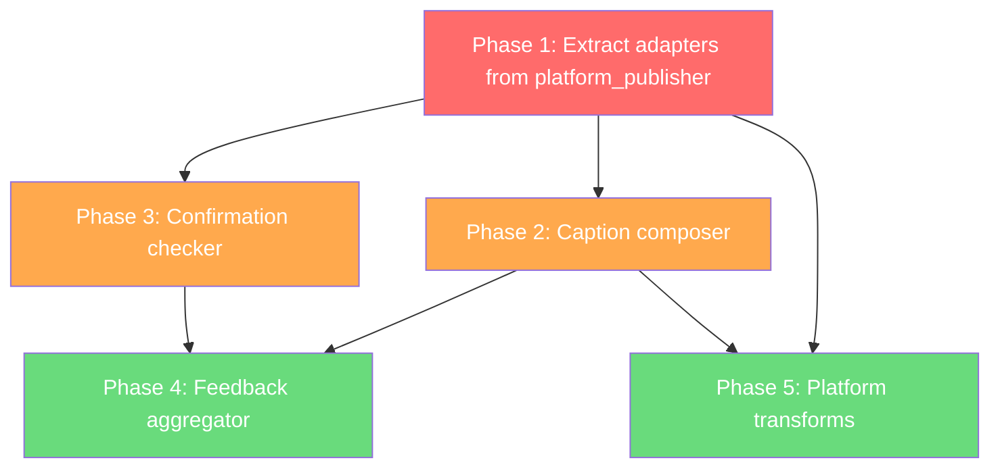

# Bolt AI v2 -- Distribution Layer: Gap Analysis and Implementation Plan

The updated pre-plan adds Part 3 (sections 18-24) describing a full Distribution Theory. This is an entirely new architectural layer that doesn't exist in the current codebase. Here's the analysis.

---

## What Exists Today vs What Part 3 Requires

### Current State: `platform_publisher.py`

The existing publishing module is a monolith that combines all three distribution responsibilities into one file:

| Pre-Plan Responsibility | Current Implementation | Status |
|------------------------|----------------------|--------|
| **Transform** (adapt master video per platform) | No transformation. Same file sent to all platforms. | Missing |
| **Compose** (platform-specific metadata) | `script_generator.py` generates captions at script time, not distribution time. Basic hashtag selection. No performance-based optimization. | Partial |
| **Schedule and deliver** | Buffer API + direct YouTube upload. Posts created in `platform_publisher.run()`. | Exists but monolithic |
| **Confirmation loop** (verify posts went live 15min later) | Does not exist. Publication is fire-and-forget. | Missing |
| **Feedback aggregator** (learn from performance data) | Does not exist. Analytics are collected but never feed back into distribution decisions. | Missing |

### Pre-Plan Part 3 Architecture vs Current

```
PRE-PLAN PART 3                              CURRENT CODE
------------------------------------------------------------
distribution_orchestrator.py                  (does not exist)
caption_composer.py                           (does not exist -- captions generated at script time)
adapters/youtube.py                           platform_publisher.py lines 100-200 (publish_youtube)
adapters/tiktok.py                            platform_publisher.py lines 200-300 (publish_tiktok_buffer)
adapters/instagram.py                         platform_publisher.py lines 300-400 (publish_instagram_buffer)
confirmation_checker.py                       (does not exist)
feedback_aggregator.py                        (does not exist)
```

---

## Detailed Gap Table: Section by Section

### Section 18: Core Distribution Model

| Requirement | Exists? | Notes |
|------------|---------|-------|
| Distribution is a separate layer from production | No | `platform_publisher.py` is called directly by the orchestrator as a pipeline step. No separation. |
| Master video file as the boundary | Partial | `video_pipeline.py` produces `final_video_path` but there's no "master file" concept. The same file goes everywhere. |
| Three jobs: Transform, Compose, Schedule/Deliver | No | All three are interleaved in `platform_publisher.run()` |

### Section 19: Repurpose.io Patterns

| Pattern to Copy | Exists? | Notes |
|----------------|---------|-------|
| Workflow model (source to destination) | No | No workflow definitions. Publishing is hardcoded in orchestrator. |
| Per-destination customisation | Partial | Config has per-platform settings but captions are generated once, not per-platform. |
| Captions as first-class feature | No | No caption burn-in for TikTok silent autoplay. |
| Independent failure handling | Yes | Each platform publishes independently. Failed platforms don't block others. |

### Section 20: Platform Adapter Pattern

| Requirement | Exists? | Notes |
|------------|---------|-------|
| Common adapter interface: `transform()`, `publish()`, `validate_credentials()` | No | Functions exist but with inconsistent signatures. No shared interface. |
| YouTube adapter: resumable upload, 1280x720 thumbnail, title from hook | Partial | Direct YouTube upload exists. Thumbnail exists but not 1280x720. Title not derived from hook. |
| TikTok adapter: caption burn-in for silent autoplay, 3-5 hashtags max | No | No caption burn-in. Hashtag count not enforced. |
| Instagram adapter: square thumbnail 1080x1080, cover frame from second 2, hashtags in first comment | No | No square thumbnail. No cover frame selection. Hashtags in caption not comment. |

### Section 21: Scheduling Logic

| Requirement | Exists? | Notes |
|------------|---------|-------|
| Phase 1: Fixed schedule (YouTube 13:00 EST, TikTok 19:00 EST, Instagram 12:00 EST) | Partial | Config has post times but they're UTC-based, not EST. Times differ slightly from pre-plan. |
| Phase 2: Data-informed scheduling (after 30 posts) | No | No auto-adjustment based on analytics. |
| 2-hour stagger rule between platforms | No | No enforcement of spacing between platform posts. |
| Confirmation loop: check 15min after scheduled post | No | Fire-and-forget. No verification that posts went live. |
| 24h metric fetch into Publication records | Partial | Analytics tracker fetches metrics but doesn't update individual Publication records (DB method exists but nothing calls it). |

### Section 22: Distribution Growth Loop

| Requirement | Exists? | Notes |
|------------|---------|-------|
| Post -> Measure -> Learn -> Adjust cycle | No | Analytics are collected but never feed back. |
| Content-aware hashtag selection based on performance | No | Static hashtag lists per pillar. |
| Hook performance correlation after 30 posts | No | No hook type tracking or performance analysis. |
| Affiliate link rotation in captions | No | No affiliate link management. |

### Section 23-24: Build Sequence and New Modules

| Module | Exists? | Notes |
|--------|---------|-------|
| `distribution_orchestrator.py` | No | New module needed |
| `caption_composer.py` | No | New module needed |
| `adapters/youtube.py` | No | Extract from `platform_publisher.py` |
| `adapters/tiktok.py` | No | Extract from `platform_publisher.py` |
| `adapters/instagram.py` | No | Extract from `platform_publisher.py` |
| `confirmation_checker.py` | No | New module needed |
| `feedback_aggregator.py` | No | New module needed |

---

## Implementation Plan

### Phase 1: Extract and Refactor (foundation)

**Goal:** Split `platform_publisher.py` into the adapter pattern without changing behavior.

1. Create `code/adapters/` directory with `__init__.py`
2. Extract `publish_youtube()` into `adapters/youtube.py` implementing the common interface
3. Extract `publish_tiktok_buffer()` + `publish_tiktok_direct()` into `adapters/tiktok.py`
4. Extract `publish_instagram_buffer()` + `publish_instagram_direct()` into `adapters/instagram.py`
5. Define the adapter interface:
   ```python
   class PlatformAdapter:
       def transform(self, master_video_path, script, article, config) -> PlatformPackage: ...
       def publish(self, package, config) -> PublicationResult: ...
       def validate_credentials(self, config) -> bool: ...
   ```
6. Update `platform_publisher.py` to become the thin `distribution_orchestrator.py` that loads adapters and calls them

### Phase 2: Caption Composer

**Goal:** Move caption generation from script-time to distribution-time with platform-specific optimization.

1. Create `code/caption_composer.py`
2. Move caption generation logic from `script_generator.py`'s `PLATFORM_CAPTIONS_PROMPT` into the composer
3. Each adapter's `transform()` calls `caption_composer.compose(script, article, platform, config)` to get platform-specific metadata
4. YouTube: title from script hook (max 100 chars), description with source URL
5. TikTok: hook + 2 facts + catchphrase + 3-5 hashtags
6. Instagram: punchline as standalone caption, hashtags for first comment

### Phase 3: Confirmation Checker

**Goal:** Verify posts went live and update Publication status.

1. Create `code/confirmation_checker.py`
2. Job runs 15 minutes after each `scheduled_at` timestamp
3. For each pending Publication: query the platform API for the post
4. Update status to `live` or `failed`, create retry job if failed
5. Register as a recurring job in the job worker

### Phase 4: Feedback Aggregator

**Goal:** Close the growth loop by learning from performance data.

1. Create `code/feedback_aggregator.py`
2. Weekly job that reads all Publications with metrics
3. Calculates:
   - Best content pillar per platform
   - Best posting time per platform
   - Best hook pattern correlation with completion rate
   - Best-performing hashtags per pillar
4. Writes a `performance_config` override to DB
5. Distribution orchestrator and caption composer read these overrides

### Phase 5: Platform-Specific Transforms

**Goal:** Each adapter produces optimized output for its platform.

1. TikTok adapter: burn captions into video for silent autoplay (FFmpeg subtitle overlay)
2. Instagram adapter: generate 1080x1080 square thumbnail, select cover frame from second 2
3. YouTube adapter: generate 1280x720 thumbnail
4. Enforce the 2-hour stagger rule between platform posts

---

## Dependency Graph



**Red:** Must do first (structural refactor)
**Orange:** Core new functionality
**Green:** Growth loop and polish

---

## What This Means for the Existing Code

The key pre-plan constraint is: **distribution never imports from production pipeline modules**. They share only the database. This means:

- `content_automation_master.py` stops calling `platform_publisher.run()` directly
- Instead, after `video_pipeline` writes a video to DB, the orchestrator creates a `Job(type='distribute')` 
- The distribution orchestrator picks it up via the job worker, reads Video + Script from DB, runs adapters
- This is the same pattern we already implemented for HITL approval: scheduler creates job, job worker executes

The existing `platform_publisher.py` becomes the scaffold for `distribution_orchestrator.py` -- same function, cleaner architecture.

---

## Summary

Part 3 describes 7 new modules that don't exist today. The current `platform_publisher.py` contains about 30% of the needed functionality (the actual posting logic) but none of the architecture (adapter pattern, confirmation loop, feedback aggregation, content-aware caption composition). The implementation plan is 5 phases, with Phase 1 being a no-behavior-change refactor that creates the adapter structure everything else builds on.
