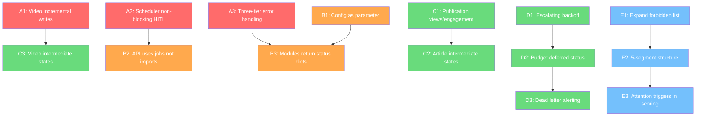

# Bolt AI v2 -- Pre-Plan Alignment Remediation Plan

## The Core Problem

The pre-plan is a precise document. It defines not just *what* to build, but *how* to build it -- seven architectural layers, six coding patterns, three error categories, four decision trees, and explicit module contracts. The implementation gets the *what* right (pipeline works, modules exist, features are present) but diverges significantly on the *how*. These structural divergences create three real-world risks:

1. **Crash recovery is fragile.** The video pipeline writes nothing to DB until all sub-steps complete. Kill the process after audio synthesis but before avatar generation and you lose 60+ seconds of API cost and processing. The pre-plan's incremental status writes (`audio_ready` -> `avatar_ready` -> `assembled`) exist specifically to solve this.

2. **The scheduler can freeze.** `wait_for_approval()` blocks the scheduler process with a 12-hour polling loop. If HITL approval takes 6 hours, the scheduler is frozen for 6 hours. No other scheduled task runs. The pre-plan explicitly says the scheduler creates a job and exits -- the job worker handles everything after the human gate.

3. **Bugs hide in broad exception handlers.** The orchestrator wraps every step in `try/except Exception`. A `KeyError` from a typo looks the same as a `ConnectionTimeout` from a flaky API. The pre-plan's three error categories exist because the correct response to each is fundamentally different: retry vs notify vs crash.

The feature gaps (no Kling AI B-roll, no HeyGen, missing Publication metrics) are secondary. They're missing features, not structural problems. The coding method violations are structural -- they compound over time and make the system harder to debug, harder to extend, and less reliable under real load.

---

## What Doesn't Need Fixing

Before the remediation list, it's worth noting what the implementation does well:

- **The three invariant rules are all respected.** `content_id` is immutable and flows everywhere. Modules don't import each other. The job worker decouples stages asynchronously.
- **All four data models are implemented** with correct fields and relationships.
- **The tiered fallback strategy** (voice, avatar) works exactly as designed.
- **Quality gate scoring** matches the pre-plan's decision tree.
- **The database schema** is clean, normalized, and covers the full pipeline lifecycle.
- **The HITL design** supports three approval paths as specified.

These are the hard parts. The structural issues below are refactoring work, not rearchitecting.

---

## Remediation Phases

### Phase A: Fix Structural Integrity (the three real risks)

These changes make the system crash-safe, non-blocking, and debuggable. They're the highest-value refactoring work because they affect every pipeline run.

#### A1. Video pipeline incremental DB writes

**Problem:** Video pipeline returns a single dict after all sub-steps. Process crash = lost progress.

**Fix:** After each sub-step (audio, avatar, assembly), write status and file paths to the `videos` table immediately. The module should accept `content_id` and `config`, read the Script from DB, and write Video rows incrementally.

```
After audio:  UPDATE videos SET audio_path=?, audio_provider=?, status='audio_ready'
After avatar: UPDATE videos SET avatar_path=?, avatar_provider=?, status='avatar_ready'  
After assembly: UPDATE videos SET final_path=?, thumbnail_path=?, video_ready=1, status='assembled'
```

On restart, the job worker checks `videos.status` and resumes from the last successful sub-step.

#### A2. Scheduler never blocks -- HITL via job creation

**Problem:** `wait_for_approval()` blocks the scheduler process.

**Fix:** Remove `wait_for_approval()` from the pipeline flow entirely. After script generation:
- Score >= 9.0 and validator passed: create `Job(type='video')` immediately
- Score 6.0-9.0: set status=`pending_review`, send notification, **exit**
- When human approves via dashboard/CLI: the approve handler creates `Job(type='video')`
- The job worker picks up the video job independently

The scheduler's only job is: fetch news, generate script, write result to DB, create job if auto-approved. It never polls. It never waits.

#### A3. Three-tier error handling in orchestrator

**Problem:** `try/except Exception` catches everything, masking programmer errors.

**Fix:** Replace broad exception handling with the pre-plan's three categories:

```python
# Category 1: Transient -- retry
except (ConnectionError, TimeoutError, HTTPError) as e:
    logger.warning(f"Transient failure in {step}", extra={"content_id": cid, "error": str(e)})
    db.enqueue_job(step, content_id=cid)  # retry via job worker

# Category 2: Configuration -- notify, no retry
except ConfigurationError as e:
    logger.error(f"Config failure in {step}", extra={"content_id": cid, "missing_key": e.key})
    notifier.send(...)

# Category 3: Programmer -- let it crash
# (no except clause -- KeyError, TypeError, AttributeError propagate up)
```

This requires defining a `ConfigurationError` base class and having modules raise it for missing keys/tokens instead of generic exceptions.

---

### Phase B: Align Module Contracts

These changes bring the code into compliance with the pre-plan's module contracts. They improve testability and make each module independently verifiable.

#### B1. Config as parameter, not internal load

**Problem:** Every module's `run()` calls `load_config()` internally.

**Fix:** Change every module's `run()` signature to accept `config: dict` as a parameter. The orchestrator passes config. Tests pass test config. No module calls `get_config()`.

```python
# Before (current)
async def run(config_path="code/config.json"):
    config = load_config(config_path)

# After (pre-plan compliant)
async def run(config: dict) -> list[dict]:
    # config is already loaded and secret-injected
```

Keep the `load_config()` functions as deprecated wrappers for CLI usage only.

#### B2. API server stops importing pipeline modules

**Problem:** `api.py` imports `content_automation_master` for `run_full_pipeline()` and step functions.

**Fix:** When the API needs to trigger a pipeline run, it creates a `Job(type='pipeline')` in the database. The job worker picks it up. The API never runs pipeline code in its own process.

```python
# Before (current)
@app.post("/api/pipeline/run")
async def trigger_pipeline(background_tasks: BackgroundTasks):
    from content_automation_master import run_full_pipeline
    background_tasks.add_task(run_full_pipeline)

# After (pre-plan compliant)
@app.post("/api/pipeline/run")
async def trigger_pipeline():
    db = get_db()
    db.enqueue_job("pipeline_full")
    return {"status": "queued"}
```

This also eliminates the `BackgroundTasks` usage which could fail silently if the API process restarts.

#### B3. Modules return status dicts, never raise

**Problem:** Modules can raise exceptions that the orchestrator catches.

**Fix:** Each module returns a result dict with a `status` field:

```python
# Module returns
{"status": "success", "content_id": "bolt_...", "data": {...}}
{"status": "failed", "error": "Connection timeout to Vidnoz API", "retriable": True}
{"status": "config_error", "error": "VIDNOZ_API_KEY not set", "retriable": False}
```

The orchestrator checks `result["status"]` and routes to the appropriate handler (retry, notify, or skip). No try/except on module calls.

---

### Phase C: Complete the Data Model

These fill in the gaps between the pre-plan's data models and the actual schema.

#### C1. Add views and engagement_rate to publications table

```sql
ALTER TABLE publications ADD COLUMN views INTEGER DEFAULT 0;
ALTER TABLE publications ADD COLUMN engagement_rate REAL DEFAULT 0;
```

`analytics_tracker.py` should update these fields 24h after `published_at`, creating the feedback loop the pre-plan describes.

#### C2. Add intermediate article states

Currently articles go `pending -> used | skipped`. Pre-plan specifies `fetched -> scored -> queued -> used | skipped`. Add the intermediate states so the dashboard can show where articles are in the pipeline.

#### C3. Add intermediate video states

Currently `pending -> assembled | failed`. Pre-plan specifies `pending -> audio_ready -> avatar_ready -> assembled | failed`. This is a prerequisite for Phase A1 (incremental writes).

---

### Phase D: Job Worker Escalating Backoff

#### D1. Implement the pre-plan's retry escalation

```
Attempt 1 fails: retry in 5 minutes
Attempt 2 fails: retry in 30 minutes  
Attempt 3 fails: retry in 2 hours + error notification
Attempt 4 fails (max): status=dead, dead_letter log, critical notification
```

Change `fail_job()` to calculate backoff based on attempt number:

```python
BACKOFF = {1: 300, 2: 1800, 3: 7200}  # seconds
def fail_job(self, job_id, error, attempt):
    delay = BACKOFF.get(attempt, 7200)
    # ...
```

#### D2. Add budget-deferred status

When `BudgetExceededError` is raised, set `status='deferred'` with `next_run_at=midnight UTC`. This is not a failure -- it's a planned delay.

#### D3. Dead letter alerting

When a job reaches max attempts, write to a `dead_letters` log table and send a CRITICAL notification. Currently these jobs just sit in `retrying` status forever.

---

### Phase E: Content Quality Encoding (Lower Priority)

These encode the pre-plan's content theory into the system. They improve output quality but aren't structural.

#### E1. Expand the forbidden list

Add the full forbidden list from the pre-plan to `content_validator.py`:
- Opening killers: greetings ("hey everyone", "what's up guys", "welcome back"), hedged openings ("this might sound weird"), context-before-hook patterns
- Content killers: multiple CTAs, undefined jargon, more than 3 facts, vague sourcing ("some experts say", "reportedly")

#### E2. Encode the 5-segment video structure

Update `SCRIPT_FORMAT` in `script_generator.py` to match the pre-plan's timing:
```
[HOOK 0-3s] -- one sentence, no greeting
[STAKES 3-8s] -- why this matters to YOU
[PAYLOAD 8-30s] -- maximum 3 facts
[PUNCHLINE 30-40s] -- surprising conclusion
[CTA + CATCHPHRASE 40-45s] -- exactly one ask
```

#### E3. Add the 5 attention triggers to scoring

Enhance the Claude scoring prompt to explicitly evaluate whether a script uses at least one of: specificity shock, identity threat, counterintuitive contradiction, free value signal, or social proof with stakes.

---

## Execution Order



**Red = Phase A** (structural integrity -- fix first)
**Orange = Phase B** (module contracts -- fix second)
**Green = Phase C + D** (data model + job worker -- can run in parallel)
**Blue = Phase E** (content quality -- lowest priority)

---

## What This Does NOT Include

- **Kling AI B-roll integration** -- Net new feature, not a pre-plan alignment issue. The pre-plan describes it but the pipeline works without it.
- **HeyGen avatar upgrade** -- Same. Paid tier upgrade, not structural.
- **CI/CD pipeline** -- Important but outside the pre-plan scope.
- **Database migrations** -- Needed for schema changes in Phase C, but the mechanism (alembic vs manual) is an implementation detail.
- **Dashboard SSE real-time updates** -- Already partially implemented. Polish, not structural.

---

## The Philosophical Point

The pre-plan is opinionated about one thing above all else: **every decision should be traceable to a database state.** The system should be stoppable at any point and restartable without losing work or repeating work. The coding method violations all share a common root: they bypass the database as the source of truth, either by holding state in memory (config globals, in-memory dedup sets), blocking on human input (HITL polling), or writing to disk without writing to DB (cost tracker JSON, queue JSON files).

The remediation path is straightforward: make the DB the only place where state exists, make every module a pure function of DB state + config, and make the orchestrator the only thing that knows what order things happen in. The pre-plan already told us this. The code just needs to catch up.
